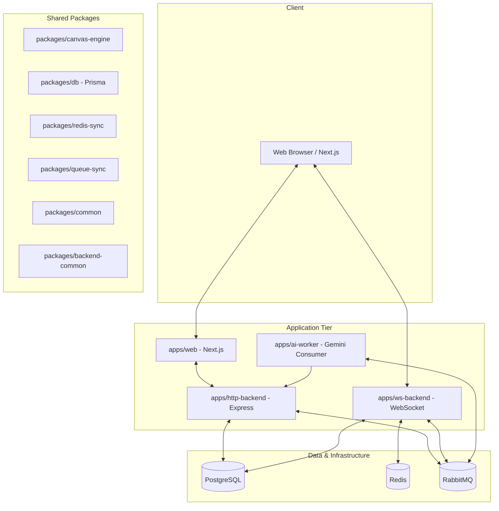

# Architectural Overview

This document describes the high-level architecture, data models, and synchronization strategies of Canvas.io.

## System Design

Canvas.io is built as a modular monorepo using Turborepo. It comprises several independent but interconnected services and shared packages.

### Component Map

## Data Layer

Canvas.io uses PostgreSQL for long-term persistence, Redis for real-time state authority, and RabbitMQ for durable messaging.

### Database Schema (Prisma)

- **User:** Stores user profiles, authentication metadata, and relationships to rooms.
- **Room:** The core collaboration unit. Tracks the owner (`adminId`) and a human-readable `slug`.
- **RoomMember:** Junction table for room access and membership.
- **RoomAccessRequest:** Manages the lifecycle of access requests for private rooms.
- **Chat:** Stores messages linked to rooms, users, and optionally specific canvas shapes (comments). Supports Group, Direct, and Comment message types.
- **Shape:** Stores serialized canvas elements (geometry, text, props) for each room.

### DB Resilience

All database interactions pass through a shared Prisma client wrapper (`@repo/db/client`) that provides:

- **Bounded Exponential Retry:** Automatically retries transient faults (network blips, deadlocks).
- **Circuit Breaker:** Fails fast with a 503 status when transient failures become sustained, preventing resource exhaustion.

## Real-time Synchronization

Canvas.io uses a hybrid strategy to balance low latency with strong durability.

### Redis: State Authority

- **Version Control:** Redis stores the authoritative `version` for each room. Every snapshot commit must pass a version check (Optimistic Concurrency Control).
- **Snapshots:** The latest full canvas snapshot is cached in Redis for extremely fast room joins and recovery.

### RabbitMQ: Durable Messaging

- **Cross-Node Fan-out:** When a WebSocket node accepts a new snapshot, it publishes an event to RabbitMQ.
- **Ordering & Partitions:** Events are routed based on `roomId` to ensure per-room ordering across nodes.
- **Idempotency:** Every event includes an `actionId`. Peer nodes use this to deduplicate messages received via multiple paths (e.g., RabbitMQ + Redis Pub/Sub fallback).

### Sync Flow

1.  **Client** sends `canvas_snapshot` to **WS Node A**.
2.  **WS Node A** atomically validates and updates the room version and snapshot in **Redis**.
3.  On success, **WS Node A** publishes a durable event to **RabbitMQ**.
4.  **WS Node B** consumes the event, validates the monotonic version, and broadcasts it to its local **Clients**.

## AI Generation Pipeline

AI-assisted diagramming is handled asynchronously to prevent blocking the HTTP request-response cycle.

1.  **User** requests generation via the **HTTP Backend**.
2.  **HTTP Backend** enqueues a job in **RabbitMQ**.
3.  **AI Worker** consumes the job, calls the **Gemini API**, and processes the result.
4.  **AI Worker** posts the generated shapes back to the **HTTP Backend** via an internal, secret-guarded endpoint.
5.  **User** polls for the status or receives the update via the next canvas sync.
