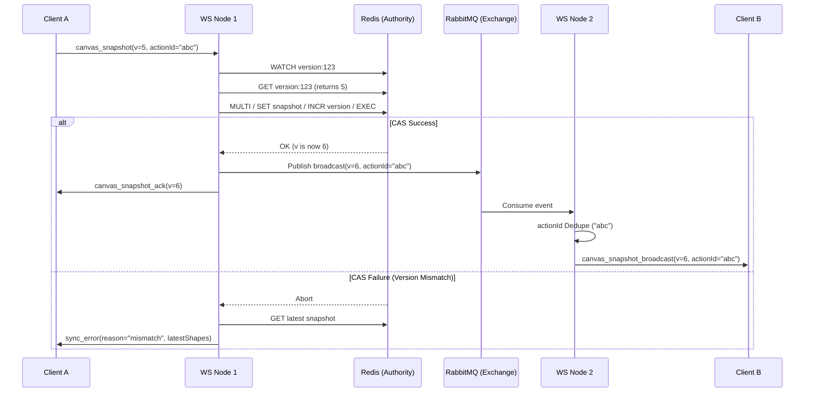

# Architecture Deep Dive: Real-time Synchronization

## Summary

Canvas.io uses a hybrid synchronization model combining **Redis** for state authority and **RabbitMQ** for durable cross-node event delivery. This dual-transport approach ensures that the "source of truth" is always consistent while updates reach all users reliably and in order.

## Intent & Expectations

Our goal was to create a "sub-millisecond feel" for local drawing while ensuring that peer updates arrive smoothly without corrupting the canvas state. We expected the system to:

1.  **Prevent Overwrites:** If two users edit the same shape simultaneously, only one should "win" based on a strict versioning contract (Optimistic Concurrency Control).
2.  **Scale Horizontally:** The system must support thousands of rooms distributed across multiple WebSocket nodes.
3.  **Recover Gracefully:** If a user disconnects or a node restarts, the canvas should resync to the latest state immediately upon reconnection using cached Redis snapshots.

## The Approach: Hybrid Transport & Atomic Authority

### 1. Redis: The Source of Truth

Redis holds the authoritative state for every room. We use three primary data structures:

- **`canvas:room:version:<roomId>`**: An integer tracking the monotonic version of the room.
- **`canvas:room:snapshot:<roomId>`**: A serialized JSON string of the latest full canvas state.
- **`canvas:room:<roomId>` (Channel)**: A low-latency Pub/Sub channel for immediate cross-node "fast-path" updates.

### 2. RabbitMQ: The Durable Backbone

While Redis Pub/Sub is fast, it is not durable. If a node is disconnected for 500ms, it misses events. RabbitMQ provides:

- **Durable Queues:** Each WebSocket node has a unique, durable queue (e.g., `canvas.room.events.node.<nodeId>`).
- **Partitioned Routing:** We use a `topic` exchange where the routing key is `room.partition.<roomId % 16>`. This ensures that even as we scale nodes, events for the same room follow a predictable path.

### 3. Sync Lifecycle (Sequence Diagram)

## Frontend Optimizations: "Drag Bursts"

Drawing in a browser produces events every ~8ms (120Hz). Sending a full snapshot to the server every 8ms would flood the network.

- **Normal Mode:** Snapshots are throttled to every 16-32ms.
- **Drag Burst Mode:** When the engine detects a rapid sequence of edits (consecutive snapshots within 120ms), it enters "Drag Burst" mode. In this mode, we temporarily halve the send interval and double the "in-flight" request budget. This ensures that a shape being dragged feels "fluid" to peers, with minimal lag.

## WebSocket Lifecycle: Connection & Event Flow

The real-time collaboration experience follows a strict state-machine lifecycle:

1.  **Connection:** The client establishes a WebSocket connection. Authentication is verified via JWT (extracted from cookies).
2.  **Handshake (`join_room`):**
    - Client sends `join_room` with a `roomId`.
    - Server verifies `RoomMember` status.
    - Server responds with `room_joined`, providing the **Authoritative Snapshot**, the current **Version**, and a list of other **Online Presences**.
3.  **Active Sync (Bidirectional):**
    - **Outgoing:** Local edits are batched and sent as `canvas_snapshot`.
    - **Incoming:** Remote edits arrive as `canvas_snapshot_broadcast`.
4.  **Presence:**
    - Clients periodically send `update_presence` (cursor position, selected shape IDs).
    - Server broadcasts `room_presence_state` to all peers.
5.  **Termination:** On disconnect, the server removes the user from the presence list and broadcasts the update to remaining peers.

## Idempotency & The `actionId`

To prevent a node from processing the same update twice (once from RabbitMQ and once from a Redis Pub/Sub fallback), every snapshot is tagged with a unique `actionId`.

- Nodes maintain a sliding-window cache of recent `actionIds`.
- If an incoming event matches a known `actionId`, it is silently discarded.

## Why this approach? (Rationale)

We considered several alternatives:

- **Why not Pure Redis Pub/Sub?** Redis Pub/Sub is "fire and forget." During a node restart or network hiccup, events are lost forever.
- **Why not Pure Database Polling?** Postgres `LISTEN/NOTIFY` has limits on payload size (8KB) and creates high CPU overhead on the primary relational store.

**The Hybrid Winner:** Redis provides the atomic "Locking" and fast versioning, while RabbitMQ provides the "Guaranteed Delivery" required for professional-grade collaboration.

## Trade-offs

- **Payload Size vs. Simplicity:** We send full snapshots rather than deltas (CRDTs).
  - _Trade-off:_ This uses more bandwidth but eliminates the need for complex merge-conflict logic. We chose this for **Phase 1 Reliability**.
- **Memory vs. Latency:** WS nodes cache room state in memory.
  - _Trade-off:_ This consumes more RAM on the server but allows us to serve "Join Room" requests in <5ms without hitting the primary database.

## Future Considerations

As diagrams scale to 5,000+ shapes, we will transition to **Binary Delta Sync** (using Protocol Buffers) to reduce the network payload by up to 95%.
